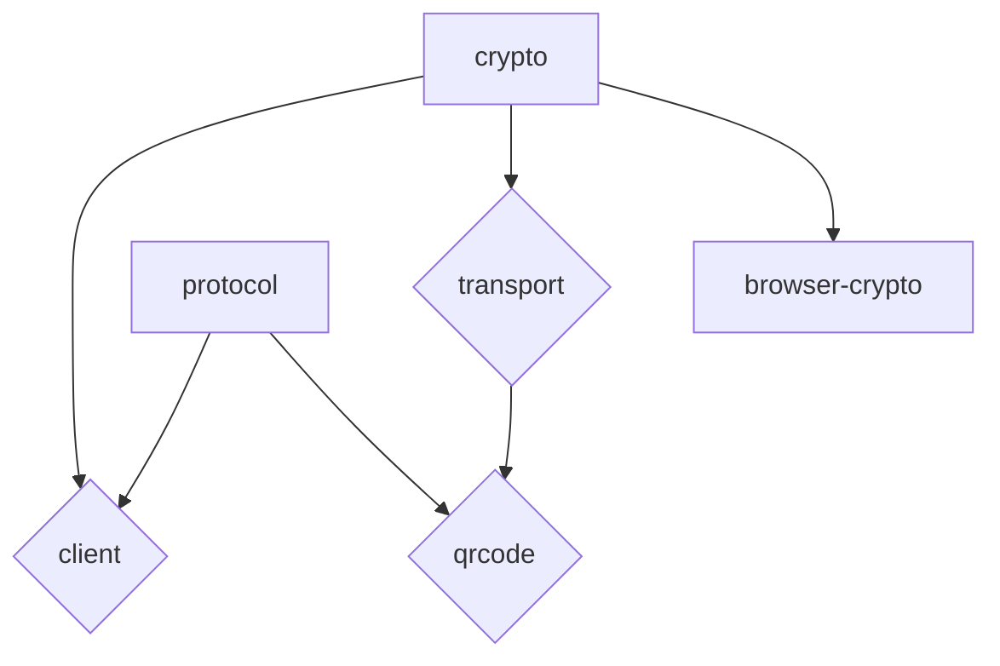

# Bitahon Client

This repository contains various libraries for the Bitahon Protocol and is maintained by the Fintoda Team.

## Packages

Below you can find a list of the packages included in this repository.

| package | npm | issues |
| ------- | --- | ------ |
| [@bitahon/protocol](packages/protocol) | | |
| [@bitahon/crypto](packages/crypto) | | | |
| [@bitahon/client](packages/client) | | | |
| [@bitahon/browser-crypto](packages/browser-crypto) | | | |
| [@bitahon/transport](packages/transport) | | | |
| [@bitahon/qrcode](packages/qrcode) | | | |
| [@bitahon/api](packages/api) | | | |

## Package dependency relationship

