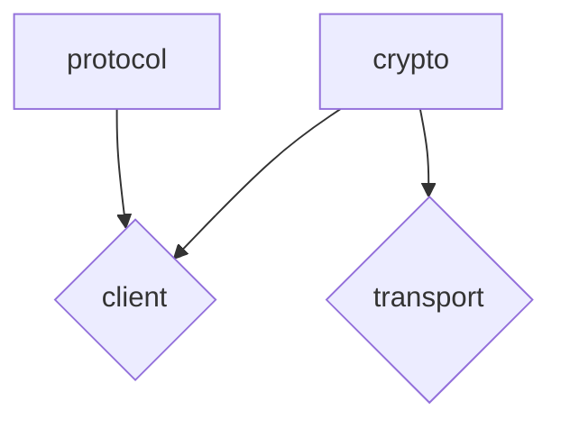

# Bitahon Client

This repository contains various libraries for the Bitahon Protocol and is maintained by the Fintoda Team.

## Packages

Below you can find a list of the packages included in this repository.

| package | npm | issues |
| ------- | --- | ------ |
| [@bitahon/protocol][protocol-package] | [![NPM Package][protocol-npm-badge]][protocol-npm-link] | [![Protocol Issues][protocol-issues-badge]][protocol-issues-link] |
| [@bitahon/crypto][crypto-package] | [![NPM Package][crypto-npm-badge]][crypto-npm-link] | [![Crypto Issues][crypto-issues-badge]][crypto-issues-link] |
| [@bitahon/client][client-package] | [![NPM Package][client-npm-badge]][client-npm-link] | [![Client Issues][client-issues-badge]][client-issues-link] |
| [@bitahon/browser-crypto][browser-crypto-package] | [![NPM Package][browser-crypto-npm-badge]][browser-crypto-npm-link] | [![Browser Crypto Issues][browser-crypto-issues-badge]][browser-crypto-issues-link] |
| [@bitahon/transport][transport-package] | [![NPM Package][transport-npm-badge]][transport-npm-link] | [![Transport Issues][transport-issues-badge]][transport-issues-link] |

## Package dependency relationship

